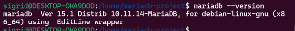
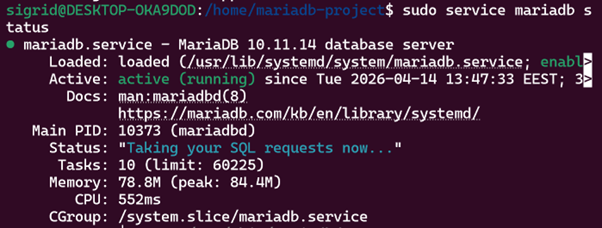
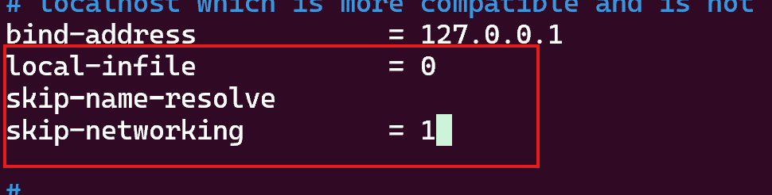
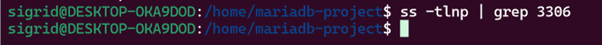
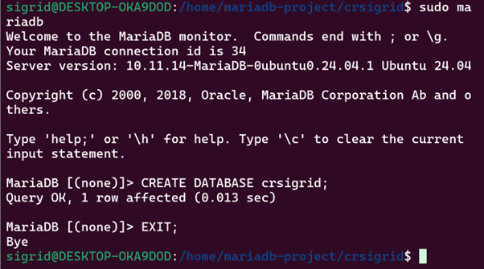
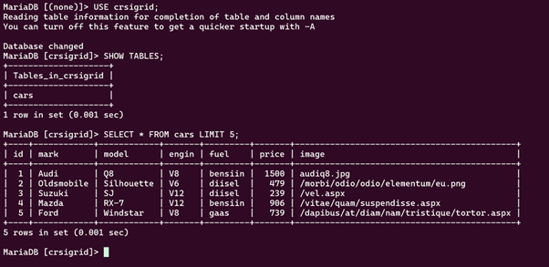

## Install Ubuntu WSL on windows 11
https://www.youtube.com/watch?v=zZf4YH4WiZo

## Süsteemi uuendamine
```bash
sudo apt update 
sudo apt upgrade -y
```

## MariaDB paigaldamine
```bash
sudo apt install mariadb-server -y
mariadb --version
sudo service mariadb start
sudo service mariadb status
```



## MariaDB turvaseadistus
```bash
sudo mqsql_secure_installation
```
```bash
switch to unix_socket authentication - Y
change the root password - n
remove anonymus users - Y
disallow root login remotely - Y
remove test databases and access to it - Y
reload privilege tables now - Y
```

## Võrguturbe konfiguratsioon
```bash
sudo nano /etc/mysql/mariadb.conf.d/50-server.cnf
```
bind-address oli juba 127.0.0.1
lisasin juurde:
local-infile = 0
skip-name-resolve
skip-networking = 1



## MariaDB taaskäivitamine ja kontroll
```bash
sudo service mariadb restart
sudo ss -tlnp | grep 3306
```
3360 ei anna tulemust, sest konfi on lisatud bind-address 127.0.0.1 ja skip-networking = 1, st et mariadb ei kuula TCP/IP võrku ehk port 3360 ei avatagi. Andmebaas on kasutatav ainult lokaalselt Unix socketi kaudu.



## Andmebaasi kloonimine
```bash
git clone git@github.com:SigridLillep/crsigrid.git
cd crsigrid
ls db
```

## Andmebaasi loomine ja kontroll
```bash
sudo mariadb
```
```sql
CREATE DATABASE crsigrid;
EXIT;
```


Andmete importimine:
```bash
sudo mariadb crsigrid < db/crsigrid.sql
```
Kontroll:
```bash
sudo mariadb
```
```sql
USE crsigrid;
SHOW TABLES;
SELECT * FROM cars LIMIT 5;
```


